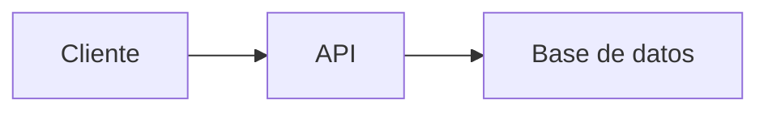

# 📚 Estudio de Roles Básicos en Desarrollo Web y Móvil

##  Recurso Usen el Link odicial para aprender git /github Todos 
https://docs.github.com/es/get-started/start-your-journey/git-and-github-learning-resources
## 0) Integrantes del equipo de estudio y sus responsabilidades en el repositorio

0. MADUEÑO/MACEDO, JOSUE ALEXANDER - FRONTEND
1. MACEDO/OROZCO, JAFET JOSHUA - FRONTEND
2. VARGAS/PAYTAN, DAVID IGNACIO - FRONTEND
3. GUEVARA/ALIAGA, OMAR ANDREE - BACKEND
4. CARRUITERO/ZEA, PIERO - BACKEND
5. PAUCA/TITO, EDSON JOAO - BACKEND
6. CAMERO/ELGUERA, JOSUE ENRIQUE - ANDROID
7. MANRIQUE/SUPANTA, RONALD WILMER - ANDROID
8. LUDEÑA/DAZA, JOSÉ RAÚL - ANDROID
9. ILLACHURA/GALDÓS, ROY PAUL - QA
10. CAHUANA/VERA, DIEGO JOAQUIN - QA
11. APAZA/CHAMBI, WILLIAM ELMER - QA

## 1) Conceptos Generales para Tener en Cuenta


## 2) Conociendo Git 
Git es una herramienta de control de versiones distribuida que facilita la administración de cambios en los archivos, conserva el historial completo del proyecto y permite el trabajo colaborativo sin riesgo de perder información.

**¿En que nos puede ayudar?**

1. **Control de versiones:** Permite registrar y volver a versiones anteriores del proyecto.
2. **Trabajo en equipo:** Varios desarrolladores pueden colaborar en el mismo proyecto sin sobrescribir el trabajo de otros.
3. **Ramas para desarrollo paralelo:** Facilita crear branches para probar nuevas funciones sin afectar el código principal.
4. **Seguridad e integridad:** Cada cambio está identificado por un hash criptográfico, evitando pérdida o corrupción de datos.
5. **Integración con herramientas y automatización:** Se conecta con plataformas como GitHub, GitLab y Bitbucket para revisión de código, CI/CD y despliegues automáticos.

## 3) Conociendo Github  

- **Describiendo el uso de repositorio remoto:**  
  Un repositorio remoto es una copia del proyecto alojada en la nube en lugar de estar únicamente en tu computadora. Plataformas como GitHub son muy utilizadas para este propósito, ya que permiten que cualquier integrante del equipo acceda al código, realice modificaciones y colabore desde cualquier lugar.

- **¿Cómo definimos repositorio?**  
  Un repositorio es un contenedor de archivos y carpetas de un proyecto, incluyendo su historial de versiones. Puede ser:
  - **Repositorio local:** el que está en tu computadora.
  - **Repositorio remoto:** el que se encuentra en GitHub.  
    Los repositorios permiten:
	-Almacenar el código del proyecto.
	-Llevar control de versiones de los archivos.
	-Trabajar en equipo sin interferencias.
	-Compartir el proyecto fácilmente.
	-Colaborar de forma remota.

- **¿Cómo configurar para permitir al equipo colaborar?**  
  1. **Crear el repositorio en Git Hub**  
     - Un miembro del equipo crea el repositorio en GitHub.
     - Puede ser público (visible para todos) o privado (solo miembros invitados pueden ver).

  2. **Clonar el repositorio**  
     Cada miembro del equipo debe clonar el repositorio remoto a su computadora:

     ```bash
     git clone https://github.com/usuario/proyecto.git
     ```

  3. **Agregar colaboradores**  
     - Desde GitHub, ir a Settings > Collaborators.
     - Invitar a los miembros del equipo con sus cuentas GitHub.

  4. **Trabajar con ramas**  
     Cada desarrollador puede trabajar en una rama para evitar conflictos:

     ```bash
     git checkout -b nueva-rama
     ```

     Luego se combinan los cambios al proyecto principal (main/master) mediante pull requests.

- **Supervisión de posibles conflictos:**  
  **¿Qué es un conflicto?**  
  Ocurre cuando dos personas editan la misma parte de un archivo y Git no sabe cuál conservar.  

  **Herramientas y prácticas para evitarlos:**
  - Pull frecuente: Antes de trabajar, usar `git pull` para tener la última versión.
  - Commits pequeños: Hacer cambios pequeños y claros.
  - Mensajes claros en los commits: Para saber qué hizo cada persona.
  - Revisar los Pull Requests: Antes de fusionar ramas, se revisan los cambios para detectar problemas.

**Roles básicos en el desarrollo de aplicaciones web y móviles**  
* **Project Manager:** coordina, planifica y supervisa las tareas del equipo de desarrollo.
* **Diseñador UX/UI:** diseña la experiencia de uso y la apariencia visual del producto.
* **Desarrollador Frontend:** implementa la parte visual y funcional con la que interactúa el usuario.
* **Desarrollador Backend:** desarrolla la lógica interna, el manejo de datos y la comunicación con el servidor.
* **Tester (QA):** prueba la aplicación para asegurar su correcto funcionamiento y detectar errores.
* **DevOps:** optimiza, automatiza y administra los procesos de desarrollo, integración y despliegue.
* **Scrum Master:** facilita el trabajo del equipo en metodologías ágiles, promoviendo buenas prácticas y resolución de obstáculos.

## 4) Desarrollador Frontend


## 5) Links recomendados para capacitación Rol Frontend
• 	**Sin certificaciones**
  - MDN Web Docs: Documentación oficial de HTML, CSS, 
    https://developer.mozilla.org/ 
  - JavaScript.info: Guía moderna de JavaScript
    https://javascript.info/
  - CSS-Tricks: Tutoriales avanzados de CSS y diseño
    https://css-tricks.com/
  - YouTube (Canales gratis)
    
      -Traversy Media (HTML, CSS, JS)    
      -Fazt Code (Frontend y frameworks)     
      -MiduDev (JavaScript y React)
    
•	**Con certificación**
  - Udemy: Cursos como "The Web Developer Bootcamp"
    https://www.udemy.com/
  - Platzi: Cursos completos de Frontend (JavaScript, React, etc.).
    https://platzi.com/
  - Frontend Masters: Cursos avanzados de JavaScript, React, CSS.
    https://frontendmasters.com/
  - Codecademy: Cursos interactivos de Frontend.
    https://www.codecademy.com/

• 	**Proyectos completos de ejemplo**
  - The Odin Project:
    https://www.theodinproject.com/ 
  - Frontend Practice: 
    https://www.frontendpractice.com/
  - CodeSandbox Templates: 
    https://codesandbox.io/search?query=&page=1
  - GitHub "Real World" Apps:
    https://github.com/gothinkster/realworld

• 	**Recomendadas por líderes tecnológicos**
  - Microsoft Learn (Frontend Path): 
    https://learn.microsoft.com/en-us/training/browse/?terms=frontend 
  - Google Web Fundamentals: 
    https://web.dev/learn/
  - AWS Amplify (Frontend Hosting): 
    https://aws.amazon.com/amplify/ 

## 6) Desarrollador Backend

  ## Descripción del rol:
  -El backend se encarga de la lógica interna de las aplicaciones, la gestión de datos, seguridad, autenticación, almacenamiento y procesamiento en     servidores. Aunque el usuario no lo ve directamente, el backend hace posible que las funcionalidades del frontend funcionen correctamente. En esencia, el backend construye la parte "invisible" pero esencial del sistema, asegurando que todo funcione de forma eficiente, segura y escalable.

  ## Habilidades requeridas:

  -Dominio de lenguajes como Python, Java, Node.js, Ruby, Go o PHP.

  -Manejo de bases de datos relacionales (MySQL, PostgreSQL) y no relacionales (MongoDB, Redis).

  -Diseño y desarrollo de APIs REST y/o GraphQL.

  -Conocimiento en autenticación/autorización (OAuth, JWT, sesiones).

  -Buen manejo de estructuras de datos y algoritmos.

  -Experiencia con servidores, contenedores (Docker) y despliegue en la nube (AWS, Azure, GCP).

  -Uso de control de versiones como Git.

  -Pruebas automatizadas: unitarias e integración (Postman, Jest, Mocha, etc.).

  ## Relación con otros roles:

-Frontend: el backend proporciona al frontend los datos necesarios a través de APIs. Ambos roles deben ponerse de acuerdo en el formato de los datos, los endpoints disponibles y cómo manejar posibles errores. La buena comunicación asegura que el producto funcione como una unidad coherente.

-Base de datos/DBA: trabajan estrechamente para diseñar, optimizar y mantener estructuras de datos eficientes, asegurando que las consultas sean rápidas y la información se almacene de forma segura y escalable.

-QA: el equipo de calidad también prueba la lógica del backend, asegurando que los endpoints funcionen correctamente, que las reglas de negocio se respeten, y que no existan errores lógicos o de seguridad.

-DevOps: colaboran para automatizar procesos de desarrollo, pruebas, integración y despliegue continuo. El backend se apoya en DevOps para asegurar que los servicios se ejecuten correctamente en producción.


## 7) Links recomendados para capacitación Rol Backend
°Sin certificaciones:
 -Backend Development Roadmap https://roadmap.sh/backend
 -The Odin Project https://www.theodinproject.com/paths/full-stack-javascript
 -Full Course – Backend Development with Node.js (freeCodeCamp) https://www.youtube.com/watch?v=Oe421EPjeBE
 -edX – Cursos en español sobre backend https://www.edx.org/es/aprende/backend?utm_source=chatgpt.com
°Con certificación:
 -Coursera – Meta Back-End Developer Professional Certificat https://www.coursera.org/professional-certificates/meta-back-end-developer
 -edX – Backend Web Development Certificate (University of California) https://www.edx.org/professional-certificate/ucsd-back-end-web-development
 -Cursa.app (gratuito + certificado digital) https://cursa.app/curso-desarrollo-backend-online-gratis?utm_source=chatgpt.com
 -Udacity – Backend Developer Nanodegree https://www.udacity.com/course/backend-web-developer-nanodegree--nd257
°Proyectos completos de ejemplo:
 -GitHub - Node.js Example Project https://github.com/nodejs/examples
 -Awesome Backend Projects https://github.com/sdmg15/Best-websites-a-programmer-should-visit#back-end
 -Meta Certificate Projects (Coursera) https://codigofacilito.com/cursos?search%5Bcategories%5D%5B%5D=6
 -Spring PetClinic (Java backend example) https://github.com/spring-projects/spring-petclinic
°Recomendadas por líderes (Google, Microsoft, AWS)
 -Google Cloud – Backend Tutorial https://cloud.google.com/solutions/web-app-backend
 -Microsoft Learn – Build Web APIs with .NET https://learn.microsoft.com/en-us/training/paths/build-web-api-dotnet/
 -AWS – Backend Web & Mobile Apps with Amplify https://aws.amazon.com/amplify/backend/
 -CodiHouse – Curso de Programación Backend I (América Latina) http://coderhouse.com/pe/cursos/programacion-backend-desarrollo-avanzado-de-backend?utm_source=chatgpt.com


## 8) Rol QA

- **Descripción del rol:**  
  El Quality Assurance se encarga de verificar que el software funcione correctamente, se asegura de que todo este correcto 
  y cumpla con lo que se espera. Esto es clave para garantizar una buena experiencia y evitar fallas en la producción. 

- **Habilidades requeridas:**
  - Capacidad de ejecutar y diseñar planes de prueba
  - Compromiso con la mejora continua
  - Experiencia en ambientes de aseguramiento de calidad o testing
  - Atención al detalle y pensamiento analítico
  - Resolución de problemas y enfoque preventivo
  - Buena comunicación para explicar fallos de forma clara y precisa
  - Saber usar Git para colaborar con el equipo

- **Relación con otros roles:**
  - *Backend:* se debe validar que los datos fluyan correctamente, las APIs respondan como deben y también que todo el sistema sea estable bajo diferentes escenarios.
  - *Frontend: * colaboran estrechamente para verificar que la interfaz web funcione correctamente, sea coherente con el diseño y funcione bien en lo diferentes navegadores y dispositivos.
  - *Andorid: * se aseguran que las apps funcionen sin errores, haya una buena experiencia para el usuario y se vean bien en los diferentes modelos de teléfonos.

- **Stack tecnológico:**
  - *Lenguajes:*
    - Kotlin
    - Java
    - Python
    - JavaScript
    - Ruby
    - C#
  
  - *Frameworks / Librerías:*
    - Selenium: Automatiza la navegación en páginas web simulando acciones de usuario.
    - Cypress: Ideal para pruebas rápidas y modernas en aplicaciones web.
    - Playwright: Permite probar en múltiples navegadores con gran flexibilidad.
    - Appium: Automatiza pruebas de apps móviles en Android y iOS.
    - Espresso: Herramienta oficial de Google para pruebas en Android.

    - JUnit: Para pruebas unitarias en Java.
    - TestNG: Alternativa avanzada a JUnit para pruebas más complejas.
    - PyTest: Potente y simple para pruebas en Python.
    - NUnit: Framework de pruebas unitarias para C# y .NET.

    - Postman: Para probar manualmente APIs REST.
    - Rest Assured: Automatiza pruebas de APIs en Java.
    - SoapUI: Permite probar APIs REST y SOAP, común en entornos empresariales.


## 9) Links recomendados para capacitación Rol Quality Assurance
- **Sin certificaciones**
  - ISTQB Official Glossary: Glosario oficial de términos de testing.
  https://glossary.istqb.org/
  - Guru99 Testing: Tutoriales completos de testing manual y automatizado.
  https://www.guru99.com/software-testing.html
  - Software Testing Help: Guías detalladas de QA y metodologías.
  https://www.softwaretestinghelp.com/
  - Ministry of Testing: Comunidad y recursos gratuitos de testing.
  https://www.ministryoftesting.com/
  - YouTube (Canales gratis)
    - SDET- QA Automation Techie (Automation y frameworks)
    - Software Testing Mentor (Manual testing y career guidance)
    - Testing World (Selenium, API testing, Mobile testing)
    - Execute Automation (Selenium, TestNG, Cucumber)

- **Con certificación**
  - Udemy: Cursos como "Selenium WebDriver with Java", "API Testing with Postman".
  https://www.udemy.com/
  - Coursera: Certificaciones de Google IT Support y IBM DevOps.
  https://www.coursera.org/
  - Pluralsight: Cursos avanzados de automated testing y DevOps.
  https://www.pluralsight.com/
  - Test Automation University: Cursos gratuitos con certificación de Applitools.
  https://testautomationu.applitools.com/
  - QA Academy: Bootcamps especializados en QA manual y automation.
  https://qa-academy.com/

- **Proyectos completos de ejemplo**
  - Selenium Easy: Práctica con diferentes elementos web.
  https://www.seleniumeasy.com/test/
  - The Internet (Herokuapp): Sandbox para practicar automation.
  https://the-internet.herokuapp.com/
  - Parabank: Aplicación de prueba para testing funcional.
  https://parabank.parasoft.com/parabank/index.htm
  - JSONPlaceholder: API falsa para practicar API testing.
  https://jsonplaceholder.typicode.com/
  - Swagger Petstore: API demo para testing de servicios REST.
  https://petstore.swagger.io/
  - GitHub Awesome Testing: Repositorios con frameworks y herramientas.
  https://github.com/TheJambo/awesome-testing

- **Recomendadas por líderes tecnológicos**
  - Google Testing Blog: Mejores prácticas y tendencias en testing.
  https://testing.googleblog.com/
  - Microsoft Testing Guidelines: Documentación oficial de testing.
  https://docs.microsoft.com/en-us/azure/devops/test/
  - AWS Testing Tools: Herramientas y servicios para QA en la nube.
  https://aws.amazon.com/products/developer-tools/
  - Atlassian Testing: Guías de testing integrado con Jira y Confluence.
  https://www.atlassian.com/software/jira/guides/expand-jira/testing
  - SmartBear Academy: Recursos educativos de herramientas como TestComplete.
  https://smartbear.com/learn/

- **Herramientas específicas para practicar**
  - Postman Learning Center: API testing y automation.
  https://learning.postman.com/
  - Cypress Documentation: Modern web testing framework.
  https://docs.cypress.io/
  - Playwright Documentation: Cross-browser automation.
  https://playwright.dev/
  - Robot Framework: Test automation para acceptance.
  testing https://robotframework.org/
  - JMeter Documentation: Performance testing.
  https://jmeter.apache.org/usermanual/index.html


## 10) Desarrollador Android
Responsabilidades principales: 
1. Desarrollar aplicaciones móviles nativas para Android 
2. Implementar interfaces de usuario siguiendo Material Design 
3. Integrar APIs REST y servicios web 
4. Optimizar rendimiento y consumo de batería 
5. Manejar diferentes tamaños de pantalla y versiones de Android 
6. Implementar funcionalidades específicas de móvil (cámara, GPS, sensores) 
7. Gestionar el ciclo de vida de Activities y Fragments 
8. Publicar aplicaciones en Google Play Store
- Habilidades requeridas: Kotlin/Java, Android Studio, Material Design, Room Database, Retrofit, Git, arquitectura MVVM


## 11) Links recomendados para capacitación Rol Android

**Cursos Gratuitos adicionales**
* **Google Android Basics with Compose:** [https://developer.android.com/courses/android-basics-compose/course](https://developer.android.com/courses/android-basics-compose/course)
* **Kotlin Bootcamp for Programmers:** [https://developer.android.com/courses/kotlin-bootcamp](https://developer.android.com/courses/kotlin-bootcamp)
* **CS50's Mobile App Development with React Native (Harvard):** [https://www.edx.org/cs50](https://www.edx.org/cs50) (Busca "CS50's Mobile App Development with React Native" dentro de los cursos de CS50)
* **Codecademy: Learn Kotlin:** [https://www.codecademy.com/learn/learn-kotlin](https://www.codecademy.com/learn/learn-kotlin)
* **JetBrains Academy (Kotlin Track):** [https://www.jetbrains.com/academy/](https://www.jetbrains.com/academy/) (Busca la pista de Kotlin)
* **Coursera: Android App Development for Beginners:** [https://www.coursera.org/learn/android-app](https://www.coursera.org/learn/android-app)
* **EDteam: Curso Android desde cero 2023 - Domina los fundamentos de Android y crea tu primera aplicación móvil (comienza gratis):** [https://ed.team/cursos/android](https://ed.team/cursos/android)
* **Aprender Gratis: Curso gratuito para programar Android en Kotlin:** [https://aprendergratis.es/cursos-online/curso-programar-android-en-kotlin/](https://aprendergratis.es/cursos-online/curso-programar-android-en-kotlin/)
* **Aulaclic: Curso de Android y Kotlin desde cero (lista de YouTube):** [https://www.aulaclic.es/seleccion-cursos/android_0_1.htm](https://www.aulaclic.es/seleccion-cursos/android_0_1.htm) (Busca la sección de Android)

**Documentación y Tutoriales Oficiales**
* **Android Developers Guides:** [https://developer.android.com/docs](https://developer.android.com/docs)
* **Kotlin Lang Documentation:** [https://kotlinlang.org/docs/home.html](https://kotlinlang.org/docs/home.html)
* **Jetpack Compose Documentation:** [https://developer.android.com/develop/ui/compose/documentation](https://developer.android.com/develop/ui/compose/documentation)
* **Material Design Guidelines:** [https://m2.material.io/design](https://m2.material.io/design) (Para Material Design 2) o [https://m3.material.io/](https://m3.material.io/) (Para Material Design 3, la versión más reciente)
* **Android Studio Documentation:** [https://developer.android.com/studio/intro](https://developer.android.com/studio/intro)
* **Documentación de fuentes del SO Android:** [https://source.android.com/docs](https://source.android.com/docs)

**Playgrounds y prácticas interactivas**
* **Kotlin Playground:** [https://play.kotlinlang.org/](https://play.kotlinlang.org/)
* **Exercism Kotlin Track:** [https://exercism.org/tracks/kotlin](https://exercism.org/tracks/kotlin)
* **Android Codelabs:** [https://developer.android.com/get-started/codelabs](https://developer.android.com/get-started/codelabs)

**Canales de YouTube recomendados**
* **Philipp Lackner:** [https://www.youtube.com/@PhilippLackner](https://www.youtube.com/@PhilippLackner)
* **Coding in Flow:** [https://www.youtube.com/@codinginflow](https://www.youtube.com/@codinginflow)
* **Stevdza-San:** [https://www.youtube.com/@StevdzaSan](https://www.youtube.com/@StevdzaSan)
* **The Coding Train (Daniel Schiffman):** [https://www.youtube.com/@TheCodingTrain](https://www.youtube.com/@TheCodingTrain)
* **FreeCodeCamp.org (en español):** [https://www.youtube.com/@freecodecampes](https://www.youtube.com/@freecodecampes)
* **Soy Dalto:** [https://www.youtube.com/@SoyDalto](https://www.youtube.com/@SoyDalto)

**Proyectos para practicar**
* **GitHub – Android Samples (Google):** [https://github.com/android/samples](https://github.com/android/samples)
* **Jetpack Compose Samples:** [https://github.com/android/compose-samples](https://github.com/android/compose-samples)
* **Awesome Android (GitHub list):** [https://github.com/JStumpp/awesome-android](https://github.com/JStumpp/awesome-android) (Hay varias, esta es una de las más conocidas)
* **Proyectos de Codelabs como "App de Water Me!":** [https://developer.android.com/codelabs/basic-android-kotlin-training-project-water-me](https://developer.android.com/codelabs/basic-android-kotlin-training-project-water-me) (Ten en cuenta que algunos codelabs pueden estar marcados como "desactualizados" pero siguen siendo útiles para entender conceptos básicos).


## 12) Pasos a desarrollar

1. **Integrante 0** crea repositorio remoto: `Trabajo-Relaciones-Humanas`  
2. Compartir el repositorio con compañeros:  
   - Ir a Settings ⚙️ > Collaborators  
   - Invitar usando nombre de usuario GitHub o email registrado  
3. **Compañeros invitados**:  
   - Recibirán invitación por email  
   - Clonar repositorio:  
     ```bash
     cd practica
     git clone https://github.com/TioSniperxD/Trabajo-Relaciones-Humanas
     cd EstudioRolesBasicos
     ```
   - Ver contenido con `dir` (Windows) o `ls` (Linux/Mac) ejemplo de link https://github.com/jjuarez29/PYTHON01/settings

## Conociendo algo de mermeaid y markdown
**Mermaid** y **Markdown** son herramientas complementarias pero con propósitos diferentes. Aquí te explico sus diferencias y similitudes:

     
### 🔹 **Markdown** (`.md`)
Es un **lenguaje de marcado ligero** para formatear texto plano de manera sencilla, que se convierte en HTML.

**Características**:
1. **Sintaxis simple**: Usa símbolos como `#`, `*`, `>` para títulos, listas, citas, etc.
   ```markdown
   # Título
   - Lista
   **negrita**
   ```
2. **Propósito principal**: Documentación legible en repositorios (como `README.md`).
3. **Soporte nativo en GitHub/GitLab**: Se renderiza automáticamente.
4. **No es programable**: Solo estructura texto e imágenes.

---

### 🔹 **Mermaid**
Es una **librería de diagramación** que permite crear gráficos mediante código dentro de documentos Markdown.

**Características**:
1. **Sintaxis específica**: Usa bloques de código con la etiqueta `mermaid`.
   ````markdown
   ```mermaid
   graph TD
     A[Inicio] --> B{Decisión}
     B -->|Sí| C[OK]
     B -->|No| D[Error]
   ```
   ````
2. **Propósito principal**: Generar diagramas (flujos, UML, Gantt, etc.) sin herramientas externas.
3. **Requiere soporte**: Funciona en GitHub/GitLab con renderizadores compatibles (no en todos lados).
4. **Es programable**: Permite lógica para estructurar gráficos.

---

### 🔄 **Similitudes**
1. **Ambos usan texto plano**: Son legibles sin renderizar.
2. **Se integran en `.md`**: Mermaid vive dentro de bloques de código en Markdown.
3. **Uso en documentación**: Ideales para repositorios y wikis.

---

### 📌 **Diferencias clave**
| Característica       | Markdown                          | Mermaid                          |
|----------------------|-----------------------------------|----------------------------------|
| **Función**          | Formatear texto                   | Crear diagramas                  |
| **Sintaxis**         | `# Título`, `- lista`             | `graph TD`, `pie chart`          |
| **Renderizado**      | Soporte universal                 | Requiere compatibilidad          |
| **Ejemplo**          | Hacer listas o tablas             | Hacer flujogramas o secuencias   |

---

### 🛠 **Ejemplo combinado (Markdown + Mermaid)**
````markdown
# Documentación del Proyecto

## 📊 Diagrama de flujo


## 📝 Pasos
1. Ejecutar `npm install`
2. Abrir `index.html`
````

---

### ✅ **¿Cuándo usar cada uno?**
- **Usa Markdown** para:  
  READMEs, documentación, wikis, notas simples.  
- **Usa Mermaid** para:  
  Diagramas técnicos, arquitectura, flujos de trabajo.  

### Mermaid de las diapositivas de los roles


[Enlace al diagrama en Mermaid](https://www.mermaidchart.com/app/projects/f5874fce-cb73-4493-bd73-31511908d7c5/diagrams/56548774-b1bf-4cab-bf5f-6c34c402f215/version/v0.1/edit).
