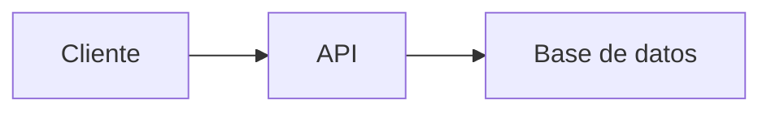

# 📚 Estudio de Roles Básicos en Desarrollo Web y Móvil

##  Recurso Usen el Link odicial para aprender git /github Todos 
https://docs.github.com/es/get-started/start-your-journey/git-and-github-learning-resources
## 0) Integrantes del equipo de estudio y sus responsabilidades en el repositorio

0. MADUEÑO/MACEDO, JOSUE ALEXANDER - FRONTEND
1. MACEDO/OROZCO, JAFET JOSHUA - FRONTEND
2. VARGAS/PAYTAN, DAVID IGNACIO - FRONTEND
3. GUEVARA/ALIAGA, OMAR ANDREE - BACKEND
4. CARRUITERO/ZEA, PIERO - BACKEND
5. PAUCA/TITO, EDSON JOAO - BACKEND
6. CAMERO/ELGUERA, JOSUE ENRIQUE - ANDROID
7. MANRIQUE/SUPANTA, RONALD WILMER - ANDROID
8. LUDEÑA/DAZA, JOSÉ RAÚL - ANDROID
9. ILLACHURA/GALDÓS, ROY PAUL - QA
10. CAHUANA/VERA, DIEGO JOAQUIN - QA
11. APAZA/CHAMBI, WILLIAM ELMER - QA

## 1) Conceptos Generales para Tener en Cuenta


## 2) Conociendo Git 


## 3) Conociendo Github  


## 4) Desarrollador Frontend


## 5) Links recomendados para capacitación Rol Frontend
• 	**Sin certificaciones**
  - MDN Web Docs: Documentación oficial de HTML, CSS, 
    https://developer.mozilla.org/ 
  - JavaScript.info: Guía moderna de JavaScript
    https://javascript.info/
  - CSS-Tricks: Tutoriales avanzados de CSS y diseño
    https://css-tricks.com/
  - YouTube (Canales gratis)
    
      -Traversy Media (HTML, CSS, JS)    
      -Fazt Code (Frontend y frameworks)     
      -MiduDev (JavaScript y React)
    
•	**Con certificación**
  - Udemy: Cursos como "The Web Developer Bootcamp"
    https://www.udemy.com/
  - Platzi: Cursos completos de Frontend (JavaScript, React, etc.).
    https://platzi.com/
  - Frontend Masters: Cursos avanzados de JavaScript, React, CSS.
    https://frontendmasters.com/
  - Codecademy: Cursos interactivos de Frontend.
    https://www.codecademy.com/

• 	**Proyectos completos de ejemplo**
  - The Odin Project:
    https://www.theodinproject.com/ 
  - Frontend Practice: 
    https://www.frontendpractice.com/
  - CodeSandbox Templates: 
    https://codesandbox.io/search?query=&page=1
  - GitHub "Real World" Apps:
    https://github.com/gothinkster/realworld

• 	**Recomendadas por líderes tecnológicos**
  - Microsoft Learn (Frontend Path): 
    https://learn.microsoft.com/en-us/training/browse/?terms=frontend 
  - Google Web Fundamentals: 
    https://web.dev/learn/
  - AWS Amplify (Frontend Hosting): 
    https://aws.amazon.com/amplify/ 

## 6) Desarrollador Backend


## 7) Links recomendados para capacitación Rol Backend


## 8) Rol QA


## 9) Links recomendados para capacitación Rol Quality Assurance


## 10) Desarrollador Android


## 11) Links recomendados para capacitación Rol Android


## 12) Pasos a desarrollar

1. **Integrante 0** crea repositorio remoto: `Trabajo-Relaciones-Humanas`  
2. Compartir el repositorio con compañeros:  
   - Ir a Settings ⚙️ > Collaborators  
   - Invitar usando nombre de usuario GitHub o email registrado  
3. **Compañeros invitados**:  
   - Recibirán invitación por email  
   - Clonar repositorio:  
     ```bash
     cd practica
     git clone https://github.com/TioSniperxD/Trabajo-Relaciones-Humanas
     cd EstudioRolesBasicos
     ```
   - Ver contenido con `dir` (Windows) o `ls` (Linux/Mac) ejemplo de link https://github.com/jjuarez29/PYTHON01/settings

## Conociendo algo de mermeaid y markdown
**Mermaid** y **Markdown** son herramientas complementarias pero con propósitos diferentes. Aquí te explico sus diferencias y similitudes:

     
### 🔹 **Markdown** (`.md`)
Es un **lenguaje de marcado ligero** para formatear texto plano de manera sencilla, que se convierte en HTML.

**Características**:
1. **Sintaxis simple**: Usa símbolos como `#`, `*`, `>` para títulos, listas, citas, etc.
   ```markdown
   # Título
   - Lista
   **negrita**
   ```
2. **Propósito principal**: Documentación legible en repositorios (como `README.md`).
3. **Soporte nativo en GitHub/GitLab**: Se renderiza automáticamente.
4. **No es programable**: Solo estructura texto e imágenes.

---

### 🔹 **Mermaid**
Es una **librería de diagramación** que permite crear gráficos mediante código dentro de documentos Markdown.

**Características**:
1. **Sintaxis específica**: Usa bloques de código con la etiqueta `mermaid`.
   ````markdown
   ```mermaid
   graph TD
     A[Inicio] --> B{Decisión}
     B -->|Sí| C[OK]
     B -->|No| D[Error]
   ```
   ````
2. **Propósito principal**: Generar diagramas (flujos, UML, Gantt, etc.) sin herramientas externas.
3. **Requiere soporte**: Funciona en GitHub/GitLab con renderizadores compatibles (no en todos lados).
4. **Es programable**: Permite lógica para estructurar gráficos.

---

### 🔄 **Similitudes**
1. **Ambos usan texto plano**: Son legibles sin renderizar.
2. **Se integran en `.md`**: Mermaid vive dentro de bloques de código en Markdown.
3. **Uso en documentación**: Ideales para repositorios y wikis.

---

### 📌 **Diferencias clave**
| Característica       | Markdown                          | Mermaid                          |
|----------------------|-----------------------------------|----------------------------------|
| **Función**          | Formatear texto                   | Crear diagramas                  |
| **Sintaxis**         | `# Título`, `- lista`             | `graph TD`, `pie chart`          |
| **Renderizado**      | Soporte universal                 | Requiere compatibilidad          |
| **Ejemplo**          | Hacer listas o tablas             | Hacer flujogramas o secuencias   |

---

### 🛠 **Ejemplo combinado (Markdown + Mermaid)**
````markdown
# Documentación del Proyecto

## 📊 Diagrama de flujo


## 📝 Pasos
1. Ejecutar `npm install`
2. Abrir `index.html`
````

---

### ✅ **¿Cuándo usar cada uno?**
- **Usa Markdown** para:  
  READMEs, documentación, wikis, notas simples.  
- **Usa Mermaid** para:  
  Diagramas técnicos, arquitectura, flujos de trabajo.  

### Mermaid de las diapositivas de los roles
[Enlace al diagrama en Mermaid]([https://acortar.link/PAjA5S](https://www.mermaidchart.com/app/projects/f5874fce-cb73-4493-bd73-31511908d7c5/diagrams/56548774-b1bf-4cab-bf5f-6c34c402f215/version/v0.1/edit)).
