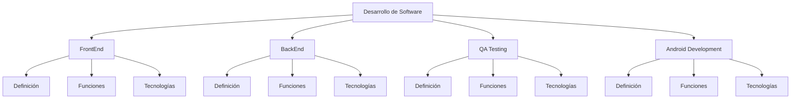

```mermaid
graph TD;
    A[Desarrollo de Software]

    A --> FE[FrontEnd]
    A --> BE[BackEnd]
    A --> QA[QA Testing]
    A --> AD[Android Development]

    FE --> FE1[Definición]
    FE --> FE2[Funciones]
    FE --> FE3[Tecnologías]

    BE --> BE1[Definición]
    BE --> BE2[Funciones]
    BE --> BE3[Tecnologías]

    QA --> QA1[Definición]
    QA --> QA2[Funciones]
    QA --> QA3[Tecnologías]

    AD --> AD1[Definición]
    AD --> AD2[Funciones]
    AD --> AD3[Tecnologías]

    click FE1 "https://blog.hubspot.es/website/frontend-y-backend" _blank
    click FE2 "https://thebridge.tech/blog/desarrollador-front-end-funciones/" _blank
    click FE3 "https://www.arsys.es/blog/frontend-que-es-y-para-que-se-utiliza-en-desarrollo-web" _blank

    click BE1 "https://blog.hubspot.es/website/frontend-y-backend" _blank
    click BE2 "https://blog.hubspot.es/website/frontend-y-backend" _blank
    click BE3 "https://aws.amazon.com/es/compare/the-difference-between-frontend-and-backend/" _blank

    click QA1 "https://www.inesdi.com/blog/que-es-un-qa-testing/" _blank
    click QA2 "https://www.inesdi.com/blog/que-es-un-qa-testing/" _blank
    click QA3 "https://www.balloon-group.com/blog/testing-qa" _blank

    click AD1 "https://www.ibm.com/mx-es/think/topics/android-development" _blank
    click AD2 "https://www.freelancermap.com/blog/es/que-hace-desarrollador-android/" _blank
    click AD3 "https://developer.android.com/studio/intro?hl=es-419" _blank

```
